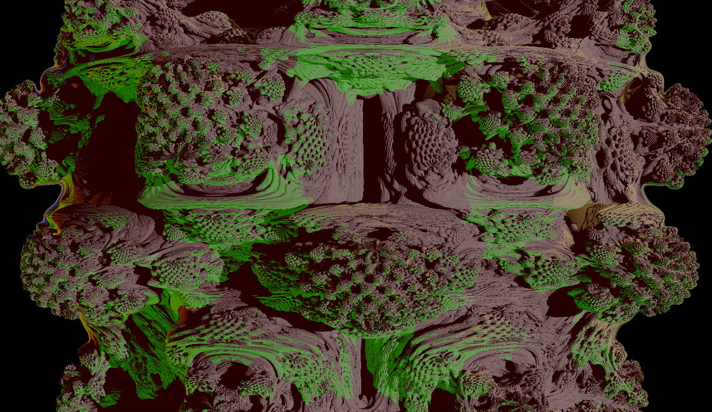
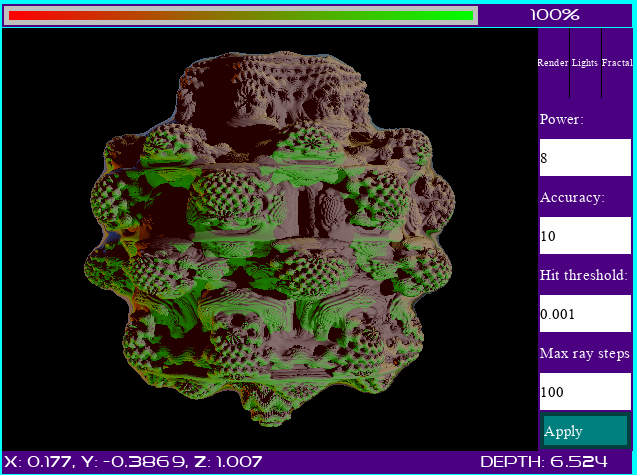
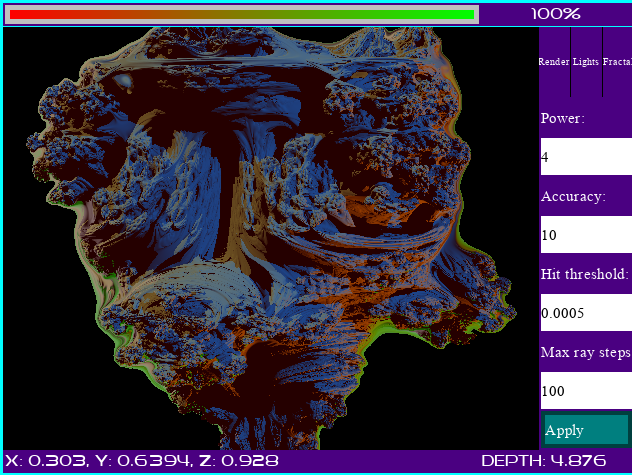
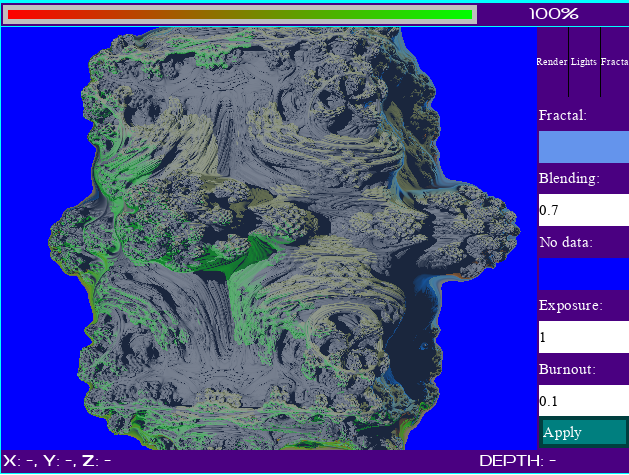

# mandelbulb

Yet another implementation of a raytracer to draw amazing mandelbulb. Allows to render a Mandelbulb like fractal with various exponent using a GPU raymarching approach. Rendering time on a `GTX 750Ti` are close to real-time which is very nice to explore some parts of the object.
Basic shading is provided through light support and multiple parameters allow to get the most out of the GPU given the level of details needed to visualize the fractal.

# Installation

- Clone the repo: `git clone git@github.com:Knoblauchpilze/mandelbulb.git`.
- Clone dependencies:
    * [core_utils](https://github.com/Knoblauchpilze/core_utils)
    * [maths_utils](https://github.com/Knoblauchpilze/maths_utils)
    * [sdl_engine](https://github.com/Knoblauchpilze/sdl_engine)
    * [sdl_core](https://github.com/Knoblauchpilze/sdl_core)
    * [sdl_graphic](https://github.com/Knoblauchpilze/sdl_graphic)
    * [sdl_app_core](https://github.com/Knoblauchpilze/sdl_app_core)
- Go to the project's directory `cd ~/path/to/the/repo`.
- Compile: `make r`.
- Install: `make install`.

Don't forget to add `/usr/local/lib` to your `LD_LIBRARY_PATH` to be able to load shared libraries at runtime.

# Usage

The application comes with a single window which represents a rendering view of the fractal along with some information panel. The status bar displays the position of the point under the mouse's cursor in real world coordinate and the depth relatively to the camera (in real world unit as well).
The view itself is updated as soon as the user changes a property in the control panels on the right or pans the view by dragging the left mouse button on the rendering canvas. Arrow keys can also be used to rotate the view.

# Features

The application allows to render a mandelbulb fractal with various exponent in near realtime using the GPU. It requires a working CUDA toolkit. The control panels are presented below:

## Render view

Allows to control the rendering properties to make the fractal more accurate and generally control the precision at which the object is rendered. These options have the most impact on performance and are set to suited values. One can decrease the hit threshold to get more details on the surface of the fractal. At some point it might also be necessary to increase the maximum ray steps as with more precise hit threshold the rays need to travel more steps before reaching the fractal. The iterations count does not have that much of an impact (surprisingly) but its value can be increased if needed.

## Lights view

Allows to control the lights used to provide some shading to the scene. A light has an intensity, a color and a direction. Any light is always oriented to the center of the scene (that is `(0, 0, 0)` in real world coordinates) and the direction is computed as the vector from the position to the origin. A light can be toggled.
The color of the light is chosen by repeatingly clicking on the colored widget next to the intensity. The colors loop at some point.

## Color view

The color view allows to control additional display parameters like the base color of the fractal (without influence of lights), the no data color (i.e. the background color) and some information about how the blending between the base color and the color provided by lights should be done.
A blending factor of `0` indicates that the final color is entirely composed of the color of the fractal (which produce a flat shading) while `1` indicates that the color of the fractal does not have any influence on the final color.
A very limited tonemapping can be used to improve the overall appearance of the rendering.